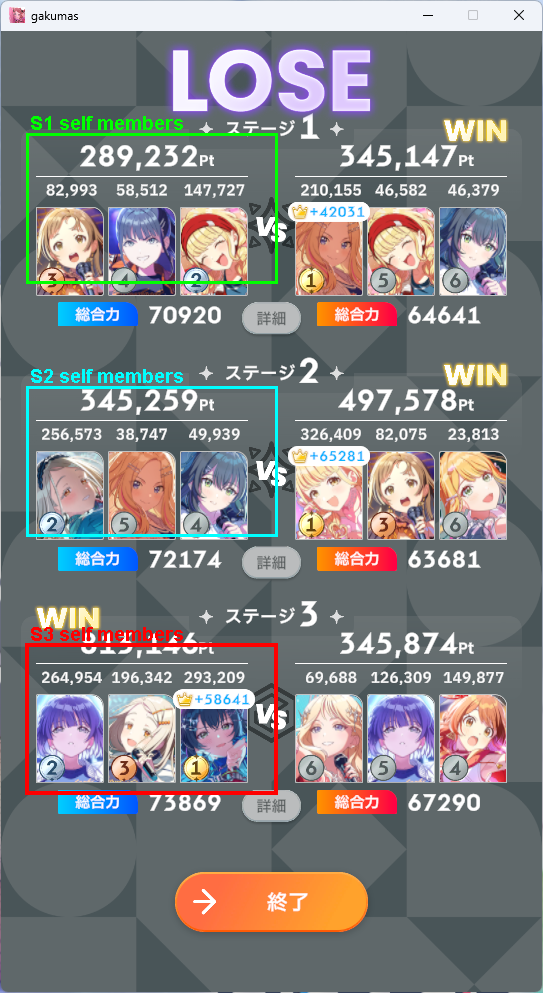
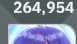
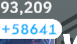

# Desktop Stage3 Self OCR Crop Investigation

## Scope

This investigation focuses on why Stage3 self extraction is frequently missing in DMM PC screenshots.

No smartphone OCR logic was modified, and no desktop expected JSON files were created.

## Dataset

Representative example:

- `desktop_002.png`
- Source: `test-images/desktop/スクリーンショット 2026-05-31 132838.png`

Current desktop OCR layout for a 543 x 993 screenshot:

| Zone | x | y | width | height |
| --- | ---: | ---: | ---: | ---: |
| S1 self total | 27 | 111 | 249 | 49 |
| S1 self members | 27 | 134 | 249 | 148 |
| S2 self total | 27 | 365 | 249 | 49 |
| S2 self members | 27 | 387 | 249 | 148 |
| S3 self total | 27 | 610 | 249 | 49 |
| S3 self members | 27 | 645 | 249 | 148 |

Debug image:



## Current OCR Behavior

Across the 15 desktop screenshots:

- Stage1 self: usually extracted.
- Stage2 self: usually extracted.
- Stage3 self: missing in 13 / 15 images.

For the representative image:

| Stage | Current self members | Current self total |
| --- | --- | ---: |
| S1 | 82,993 / 58,512 / 147,727 | 289,232 |
| S2 | 256,573 / 38,747 / 49,939 | 345,259 |
| S3 | - | 0 |

## Crop Comparison

### Wide Member Crop

The wide Stage3 self member crop contains the correct score row:


Direct OCR on this wide crop produced:

```text
264,954 196,342 293,209
+58641
```

Parsed numbers:

```text
264954, 196342, 293209, 58641
```

This means the base preprocessing can read the Stage3 self score row when the crop contains enough context.

### Slot Crop

The desktop slot fallback currently uses:

| Stage | top rate | top px | slot width | slot height |
| --- | ---: | ---: | ---: | ---: |
| S1 | 0.160 | 158 | 77 | 44 |
| S2 | 0.415 | 412 | 77 | 44 |
| S3 | 0.675 | 670 | 77 | 44 |

Representative Stage3 slot crops:






Direct OCR on those Stage3 slot crops produced:

| Slot | OCR text summary | Parsed |
| --- | --- | --- |
| 1 | `264,954` | 264954 |
| 2 | unreadable/no number | - |
| 3 | `93,209` plus crown/UI noise | 93209 |

The slot fallback therefore returns fewer than 3 usable member values and is discarded.

## Root Cause

The main issue is crop selection, not OCR preprocessing.

There are two contributing crop problems:

1. Desktop wide member zones are defined in `getFixedOcrZones()`, but the regression runner member extraction path uses `getAlternativeMemberZones()`. Desktop currently has no `memberTopCandidates`, so the wide member crop is not used for member recognition.

2. The desktop slot fallback crop is too narrow and slightly fragile for Stage3 self. It captures the score row at the very top edge, and slot 2/3 are affected by adjacent UI and the crown bonus area. This causes missing values or leading-digit loss.

Stage1/Stage2 often still succeed because their slot crops are cleaner and the later correction flow can recover some leading-digit loss. Stage3 self has more UI overlap near the bottom of the screen, so the same narrow slot strategy fails more often.

## Issue Classification

- Crop position: yes, especially slot fallback top/row placement for Stage3.
- Crop size: yes, slot width is too narrow for Stage3 and can lose leading digits.
- OCR preprocessing: not the primary cause. Wide Stage3 crop is readable with the current preprocessing.

## Recommended Crop Adjustments

Do not change smartphone OCR.

Recommended desktop-only changes for a later implementation phase:

1. Add desktop `memberTopCandidates` and `totalTopCandidates` so the existing wide-zone OCR path runs for desktop too.

   Suggested desktop member candidates around current values:

   ```js
   memberTopCandidates: [
     [0.130, 0.385, 0.635],
     [0.135, 0.390, 0.645],
     [0.140, 0.395, 0.650],
     [0.145, 0.400, 0.655],
   ]
   ```

2. Adjust desktop Stage3 self slot fallback to be slightly wider and/or higher.

   Current:

   ```text
   S3 slot top rate: 0.675
   slot widths: 31% of side
   ```

   Suggested investigation range:

   ```text
   S3 slot top rate: 0.660 - 0.670
   slot widths: 34% - 38% of side
   ```

3. Keep crown bonus exclusion/post-processing shared. The wide crop may include crown values, but existing post-processing already has crown/member separation logic.

## Files Changed

- `docs/desktop-stage3-self-crop-report.md`
- `docs/desktop-crop-debug/desktop_002-self-member-zones.png`
- `docs/desktop-crop-debug/desktop_001-s*-self-*.png`
- `docs/desktop-crop-debug/desktop_002-s*-self-*.png`
- `docs/desktop-crop-debug/desktop_003-s*-self-*.png`
- `docs/desktop-crop-debug/desktop_004-s*-self-*.png`
- `docs/desktop-crop-debug/desktop_005-s*-self-*.png`
